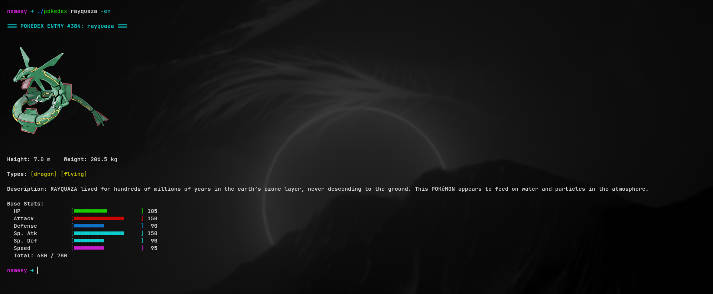

# pokedex-cli


A terminal-based Pokédex written in C. Fetches live data from [PokéAPI](https://pokeapi.co) and renders it with ANSI colors, a real rendered sprite (via [chafa](https://hpjansson.org/chafa/)), and full bilingual output.

```
=== POKÉDEX ENTRY #94: gengar ===

           ▄▄▄▄▄▄▄▄
        ▄██████████▄
       ██▀▀      ▀▀██        (sprite rendered here
      ██   ●    ●   ██        in full color by chafa)
      ██     ▄▄     ██
       ██▄  ▀▀▀▀  ▄██
        ▀██▄▄▄▄▄▄██▀
          ▀▀▀▀▀▀▀▀

Height: 1.5 m    Weight: 40.5 kg

Types: [ghost] [poison]

Description: Under a full moon, this Pokémon likes to mimic the moves of the people it is hunting.

Base Stats:
  HP               [■■■■■■■             ]  60
  Attack           [■■■■■■■■■           ]  65
  Defense          [■■■■■■              ]  60
  Sp. Atk          [■■■■■■■■■           ]  65
  Sp. Def          [■■■■■■■■           ]   75
  Speed            [■■■■■■■■■■■         ] 110

  Total: 435 / 780
```

## Features

- Fetches live Pokémon data by name from PokéAPI
- Displays ID, name, types, height, weight and Pokédex flavor text
- Renders base stats as colored ANSI bars, plus the **Base Stat Total (BST)**
- Shows the official artwork sprite directly in the terminal via `chafa`
- **Bilingual output (English / Italian)** — labels, stat names, type names and flavor text all switch language with a single flag
- Graceful error handling (unknown Pokémon, network errors, missing `chafa`)

## Requirements

| Dependency | Purpose |
|---|---|
| [libcurl](https://curl.se/libcurl/) | HTTP requests to PokéAPI |
| [cJSON](https://github.com/DaveGamble/cJSON) | JSON parsing |
| [chafa](https://hpjansson.org/chafa/) | Terminal sprite rendering (optional, but recommended) |
| GCC + `make` | Build |

### Install dependencies on Arch Linux

```bash
sudo pacman -S base-devel curl chafa
```

`base-devel` provides `gcc` and `make`. `cJSON.h` / `cJSON.c` are vendored directly in this repository, so no separate cJSON package is required.

## Build & install

```bash
git clone https://github.com/<your-username>/pokedex-cli.git
cd pokedex-cli

make               # compiles the 'pokedex' binary
sudo make install  # installs it to /usr/local/bin, so it's available system-wide
```

Once installed, run it from anywhere as `pokedex <name>`. To remove it later: `sudo make uninstall`.

Prefer a local build without installing? `make` alone produces a `./pokedex` binary you can run directly, no `sudo` required.

## Usage

```
pokedex <pokemon-name> [-it|-en]
```

The language flag is optional and order-independent — it can come before or after the name. Default language is **English**.

| Command | Result |
|---|---|
| `pokedex gengar` | Gengar's entry in English (default) |
| `pokedex gengar -it` | Gengar's entry in Italian |
| `pokedex -it charizard` | Same as above — flag before the name works too |
| `pokedex pikachu -en` | Explicitly force English |

## Project structure

```
.
├── main.c       # application source
├── cJSON.c      # vendored JSON library (implementation)
├── cJSON.h      # vendored JSON library (header)
├── Makefile     # build / install / uninstall targets
└── README.md
```

## Roadmap

- [ ] Evolution chain display
- [ ] Local caching to reduce redundant API calls (especially for translated type names)
- [ ] Config file for default language / sprite size / color theme
- [ ] Additional languages beyond English and Italian

## License

MIT — see [LICENSE](LICENSE) for details.

## Credits

Data provided by [PokéAPI](https://pokeapi.co). Sprite rendering by [chafa](https://hpjansson.org/chafa/). JSON parsing by [cJSON](https://github.com/DaveGamble/cJSON).

## 🖥️ Preview

<div align="center">
  
</div>
